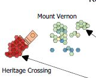
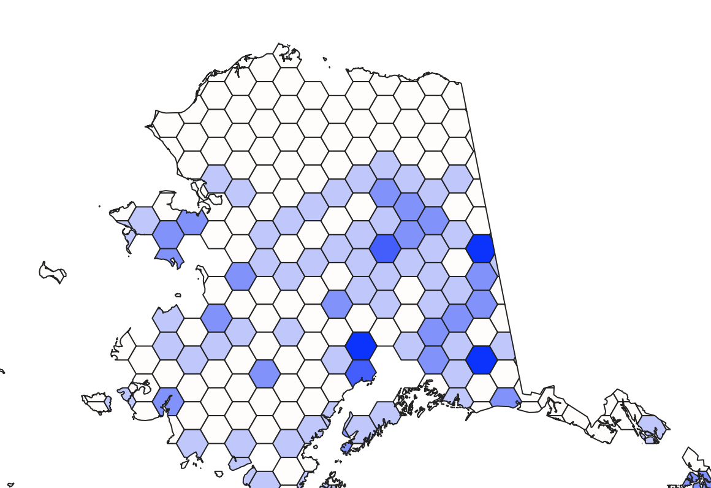

<!--This is the first row of projects -->

### Project 1 

[See more details here.](https://maryaro.github.io/project_1/project1.html)

The purpose of this project is to show the average year built of residential housing in 4 Baltimore neighborhoods based on historical events such as the construction of the B&O railroad and ban on lead paint.

<small>__Tools__: QGIS

<small>__Data__: 
[Real Property Dataset from the City of Baltimore Open GIS Data Site](http://gis-baltimore.opendata.arcgis.com/datasets/b41551f53345445fa05b554cd77b3732_0), </small>

### Project 2

[See more details here.](https://maryaro.github.io/project_2/project2.html)

The purpose of this project is to show a time lapse of the construction of residential buildings in the Mount Winans neighborhood of Baltimore

<small>__Tools__: QGIS, Photoshop

<small>__Data__:[Real Property Dataset from the City of Baltimore Open GIS Data Site](http://gis-baltimore.opendata.arcgis.com/datasets/b41551f53345445fa05b554cd77b3732_0), </small>

<!--This is the second row of projects -->

### Project 3

[See more details here.](https://maryaro.github.io/lab/aronne_lab2.md.html)

This project uses a 350px square image for the teaser image, but inside the square image, I used a circle to highlight a certain area. Pellentesque eget mauris vel mi tristique finibus vitae quis massa. Mauris vulputate, nulla vel tincidunt interdum, sem mauris scelerisque neque, suscipit pellentesque felis augue a erat. 

<small>__Tools__: QGIS, Interpolation, Photoshop

<small>__Data__: 
[Supportland](https://supportland.com/), [Oregon Craft Brew Guild](https://oregoncraftbeer.org/guild/)</small>

